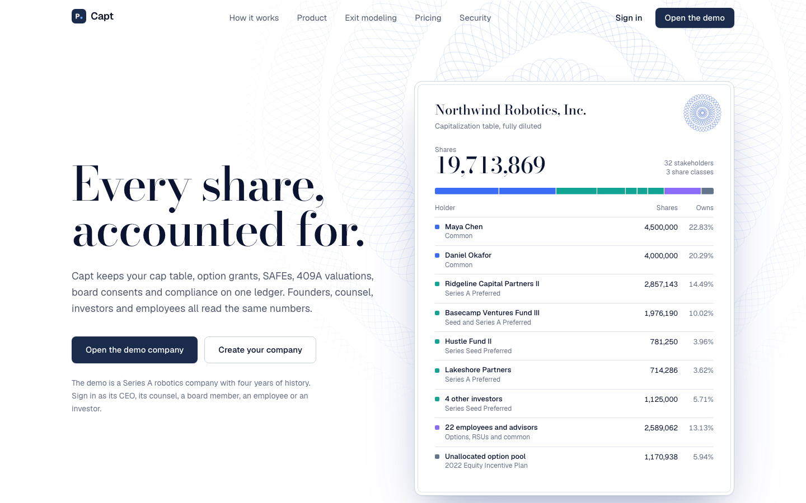
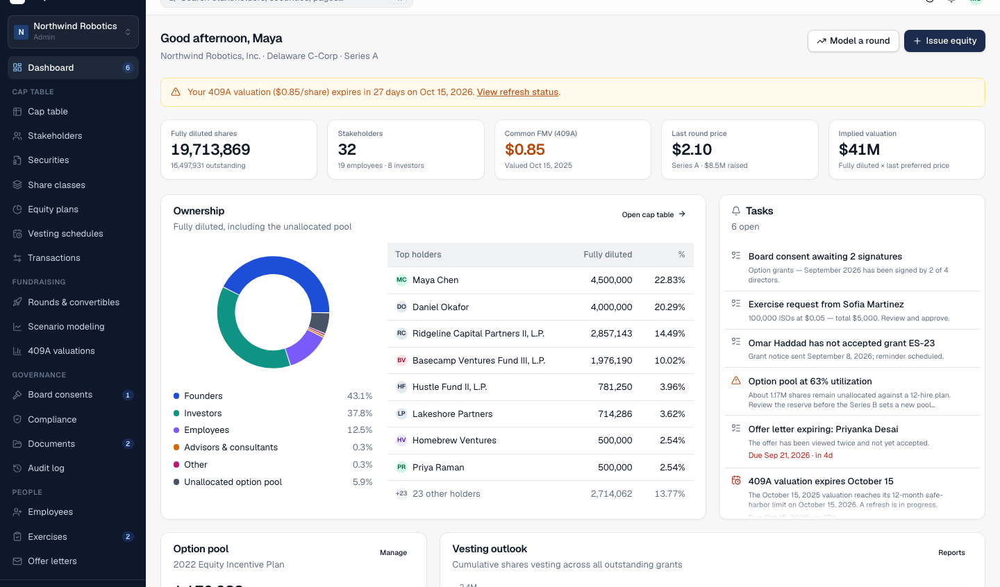
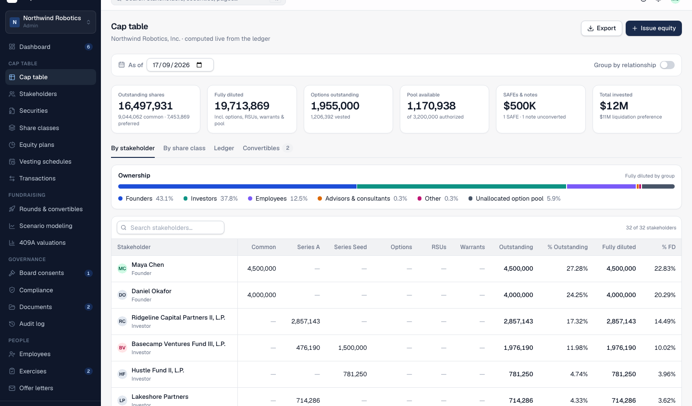
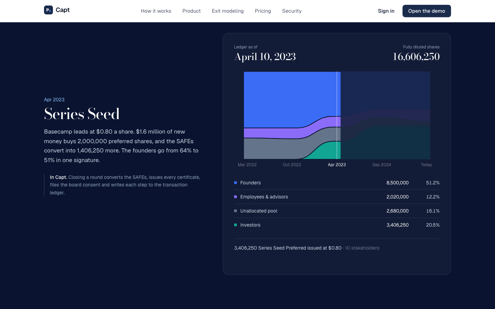
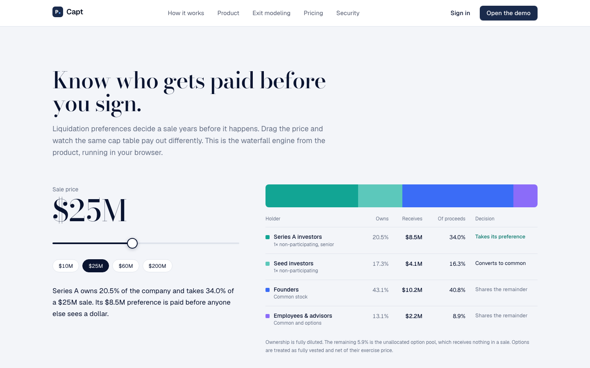

# Capt — equity management platform

A full-featured cap table and equity management application in the spirit of Pulley and Carta: cap table ledger, securities issuance with e-signature, fundraising and exit modeling, 409A valuations, board consents, compliance (Rule 701, ISO $100K, 83(b), Form 3921, ASC 718), a data room, employee and investor portals, offer letters, investor updates, liquidity programs, reports and role-based access.



| | |
| --- | --- |
|  |  |
|  |  |

## Quick start

```bash
npm run setup      # installs deps, generates the Prisma client, creates SQLite db, seeds the demo company
npm run dev        # http://localhost:3000
```

Sign in with any demo account (password `demo1234`):

| Email | Role | What you see |
| --- | --- | --- |
| `maya@northwind.dev` | Admin (CEO) | Full workspace, two companies |
| `finance@northwind.dev` | Finance | Full workspace, can edit |
| `legal@northwind.dev` | Outside counsel | Full workspace, can edit |
| `elena@ridgeline.vc` | Board member | Workspace, read-only + signing |
| `jordan@northwind.dev` | Employee | Stakeholder portal (ISO grants, exercise, tax) |
| `james@basecamp.vc` | Investor | Stakeholder portal (fund holdings, ownership, updates) |

The seeded company, **Northwind Robotics, Inc.**, has founders with restricted stock, converted SAFEs, a Series Seed and Series A, an option plan with ~25 grants (some exercised/terminated), an outstanding SAFE and convertible note, four 409A valuations plus one in progress, board consents in every status, generated documents for every security, exercise requests, offer letters, investor updates, a draft tender offer and integrations.

Other scripts: `npm test` (engine unit tests), `npm run typecheck`, `npm run lint`, `npm run db:reset` (rebuild + reseed), `npm run build`.

## Architecture

- **Next.js 16 (App Router, Turbopack), React 19, TypeScript, Tailwind v4.** Server components load data; mutations are server actions (`actions.ts` next to each route) validated with zod and recorded in the audit log.
- **Prisma + SQLite** (`prisma/schema.prisma`). Enums are strings (see `src/lib/types.ts`) and JSON columns are strings so the schema ports to Postgres by changing the datasource.
- **Equity engine** (`src/lib/equity/`) — pure TypeScript, unit-tested, used by both server and client components:
  - `vesting.ts` — time/cliff/milestone schedules, termination, acceleration, forecasts
  - `captable.ts` — outstanding vs fully diluted ownership, as-of-date reconstruction from the transaction ledger, plan utilization, certificate numbering
  - `conversion.ts` — pre/post-money SAFE and note conversion with fixed-point solving (cap, discount, MFN, accrued interest)
  - `round-model.ts` — priced-round pro-forma with pool top-ups and convertible conversion; dilution sensitivity grids
  - `waterfall.ts` — exit waterfall: stacked preferences, participation caps, non-participating conversion decisions, in-the-money option exercise
  - `asc718.ts` — Black-Scholes, simplified expected term, straight-line and graded attribution
  - `compliance.ts` — Rule 701, ISO $100K limit, 83(b) deadlines, Form 3921 records, 409A freshness
  - `tax.ts` — exercise simulator (NSO withholding, ISO AMT estimate, holding periods)
- **Auth** (`src/lib/auth.ts`) — cookie sessions, bcrypt passwords, per-company roles (Admin, Legal, Finance, Board, Employee, Investor, Viewer). `requireWorkspace` gates the admin app, `requireEditor` gates mutations, `requireCompany` gates the portal. `src/proxy.ts` performs the optimistic redirect.
- **Documents** (`src/lib/documents/templates.ts`) — markdown generators for certificates, option grant notices, SAFEs, notes, board consents, 409A summaries, offer letters, 83(b) elections, Form 3921 and Rule 701 disclosures. Documents live in a folder-based data room with signature workflows (`/sign/[token]`).
- **Marketing site** (`src/app/(marketing)`, `src/components/marketing/*`) — its own layout, display face (Bodoni Moda) and `marketing.css`, all scoped under `.mkt` so the workspace keeps its 14px density. The scroll story and hero use as-of-date snapshots of the seeded demo company (`src/lib/marketing/story.ts`), and the exit-waterfall demo calls `computeWaterfall` from the equity engine in the browser. No animation library: scroll work goes through `useScrollFrame` in `components/marketing/hooks.ts`.
- **UI** — Radix primitives wrapped in `src/components/ui/*`, `DataTable` for sortable/searchable tables, Recharts wrappers in `src/components/charts.tsx`, `ActionForm`/`FormDialog` helpers in `src/components/forms.tsx`.

## Route map

| Area | Routes |
| --- | --- |
| Marketing | `/` (scroll story, product index, live exit waterfall, role matrix), `/pricing`, `/security` |
| Auth | `/login`, `/signup` |
| Workspace | `/app/[companyId]/dashboard`, `cap-table`, `stakeholders`, `securities` (+ `new`, `[id]`), `share-classes`, `equity-plans`, `vesting-schedules`, `transactions` |
| Fundraising | `fundraising` (rounds, SAFE/note builders, term-sheet scanner), `modeling` (round modeler), `modeling/exit` (waterfall), `valuations` (409A) |
| Governance | `board` (consents), `compliance` (+ `rule-701`, `iso-limit`, `83b`, `form-3921`, `asc-718`), `documents` (data room), `audit-log` |
| People | `employees` (manage, hiring planner, refresh planner, pool forecast, HRIS), `exercises`, `offers`, `updates`, `liquidity` |
| Admin | `reports`, `settings` (company, users, integrations, billing, data import/export, notifications, profile), `help` |
| Portal | `/portal/[companyId]` (overview, holdings, vesting, ownership, exercise simulator, documents, tax center, updates, profile) |
| Public | `/sign/[token]` (e-sign), `/offer/[token]` (candidate offer), `/u/[token]` (investor update) |
| Exports | `/api/companies/[companyId]/exports/*`, `/api/companies/[companyId]/reports/[report]` (CSV/XLSX) |

## Responsive layout

The workspace sidebar is a slide-over drawer below `lg` (`MobileSidebar` in `src/components/shell/sidebar.tsx`). Grid children can shrink (`.grid > * { min-width: 0 }`) and whatever directly contains a `.data-table` scrolls sideways, so wide ledgers never stretch the page. Tab strips share `tabStripClass`/`tabItemClass` from `src/components/ui/tab-styles.ts` and scroll horizontally on phones.

## Notes

- Tax estimates use 2025 US federal figures and are labelled as estimates; nothing here is legal or tax advice.
- Email delivery, payment processing, HRIS/accounting APIs and e-signature providers are stubbed at the integration boundary; the workflows, records and audit trail are real.
- `scripts/dev-session.ts` mints a session cookie for a seeded user so pages can be fetched with `curl` during development.

## License

[MIT](LICENSE). Copyright © 2026 The Capt Authors.

You can use, change, self-host and sell Capt, as long as the copyright and license notice stay with it. The software comes with no warranty, and nothing in it is legal, tax or investment advice.
